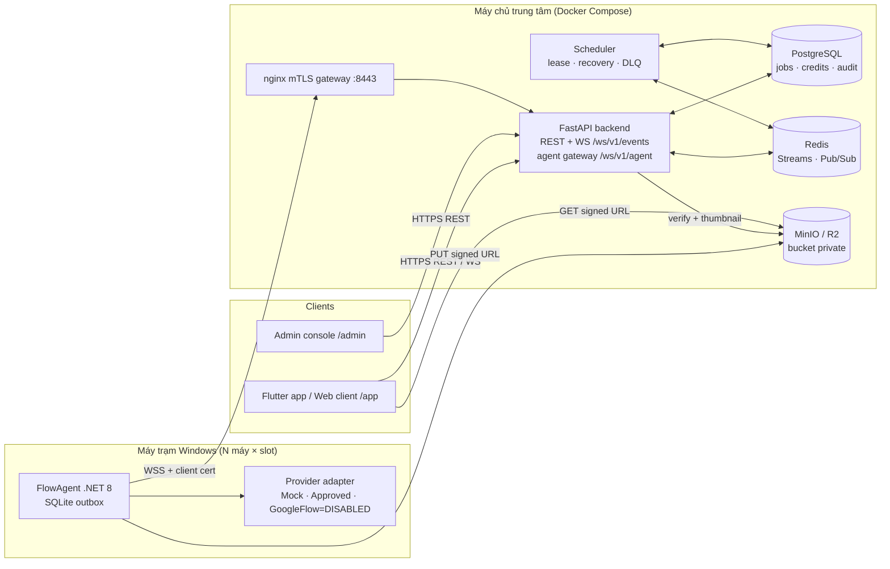
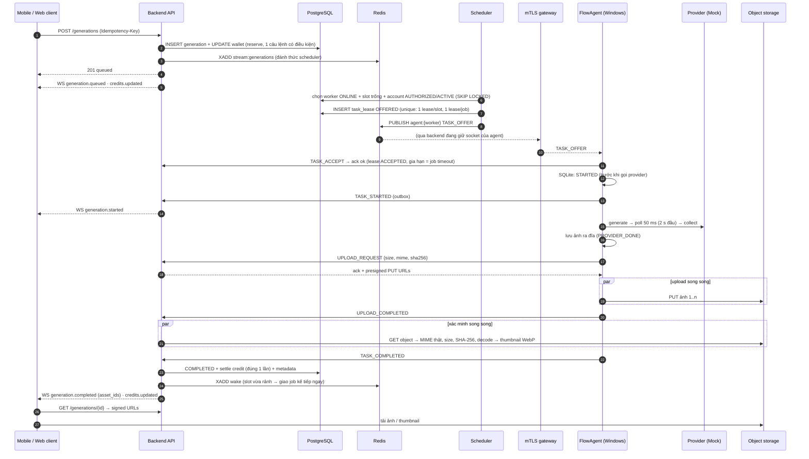
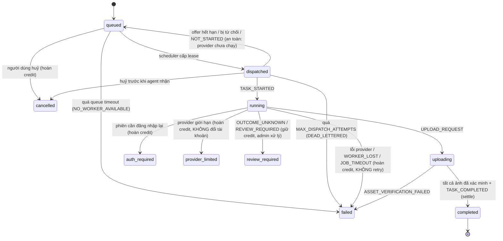
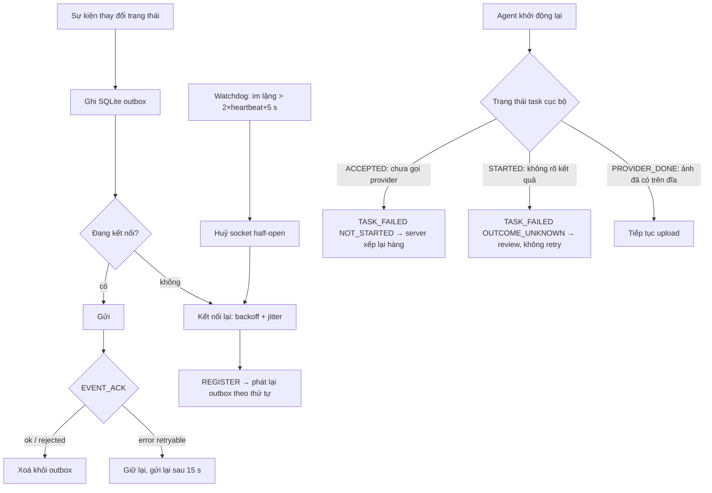
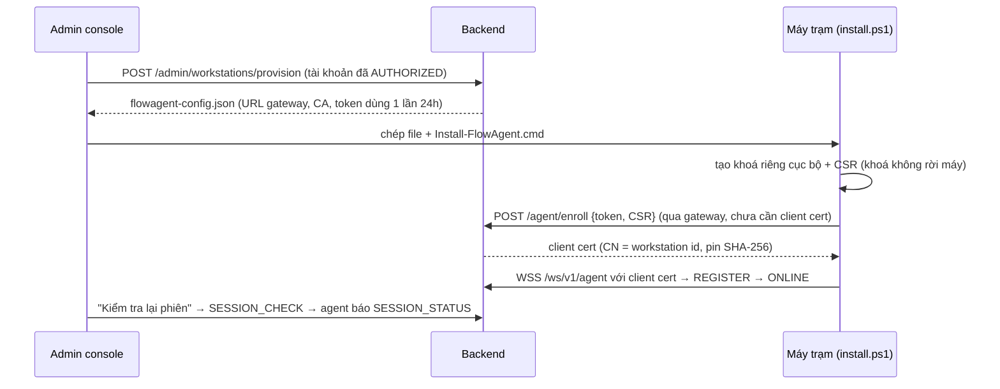

# Kiến trúc & luồng chạy

## 1. Thành phần

```mermaid
flowchart LR
  subgraph Clients
    M[Flutter app / Web client /app]
    A[Admin console /admin]
  end
  subgraph Server["Máy chủ trung tâm (Docker Compose)"]
    API[FastAPI backend<br/>REST + WS /ws/v1/events<br/>agent gateway /ws/v1/agent]
    SCH[Scheduler<br/>lease · recovery · DLQ]
    PG[(PostgreSQL<br/>jobs · credits · audit)]
    RD[(Redis<br/>Streams · Pub/Sub)]
    S3[(MinIO / R2<br/>bucket private)]
    GW[nginx mTLS gateway :8443]
  end
  subgraph Workers["Máy trạm Windows (N máy × slot)"]
    AG[FlowAgent .NET 8<br/>SQLite outbox]
    PR[Provider adapter<br/>Mock · Approved · GoogleFlow=DISABLED]
  end
  M -- HTTPS REST / WS --> API
  A -- HTTPS REST --> API
  API <--> PG
  API <--> RD
  SCH <--> PG
  SCH <--> RD
  AG -- WSS + client cert --> GW --> API
  AG --> PR
  AG -- PUT signed URL --> S3
  API -- verify + thumbnail --> S3
  M -- GET signed URL --> S3
```

## 2. Luồng một generation (đã tối ưu)

```mermaid
sequenceDiagram
  autonumber
  participant App as Mobile / Web client
  participant API as Backend API
  participant DB as PostgreSQL
  participant R as Redis
  participant S as Scheduler
  participant G as mTLS gateway
  participant W as FlowAgent (Windows)
  participant P as Provider (Mock)
  participant O as Object storage

  App->>API: POST /generations (Idempotency-Key)
  API->>DB: INSERT generation + UPDATE wallet (reserve, 1 câu lệnh có điều kiện)
  API->>R: XADD stream:generations (đánh thức scheduler)
  API-->>App: 201 queued
  API-->>App: WS generation.queued · credits.updated
  S->>DB: chọn worker ONLINE + slot trống + account AUTHORIZED/ACTIVE (SKIP LOCKED)
  S->>DB: INSERT task_lease OFFERED (unique: 1 lease/slot, 1 lease/job)
  S->>R: PUBLISH agent:{worker} TASK_OFFER
  R-->>G: (qua backend đang giữ socket của agent)
  G-->>W: TASK_OFFER
  W->>API: TASK_ACCEPT  → ack ok (lease ACCEPTED, gia hạn = job timeout)
  W->>W: SQLite: STARTED (trước khi gọi provider)
  W->>API: TASK_STARTED (outbox)
  API-->>App: WS generation.started
  W->>P: generate → poll 50 ms (2 s đầu) → collect
  W->>W: lưu ảnh ra đĩa (PROVIDER_DONE)
  W->>API: UPLOAD_REQUEST {size, mime, sha256}
  API-->>W: ack + presigned PUT URLs
  par upload song song
    W->>O: PUT ảnh 1..n
  end
  W->>API: UPLOAD_COMPLETED
  par xác minh song song
    API->>O: GET object → MIME thật, size, SHA-256, decode → thumbnail WebP
  end
  W->>API: TASK_COMPLETED
  API->>DB: COMPLETED + settle credit (đúng 1 lần) + metadata
  API->>R: XADD wake (slot vừa rảnh → giao job kế tiếp ngay)
  API-->>App: WS generation.completed (asset_ids) · credits.updated
  App->>API: GET /generations/{id} → signed URLs
  App->>O: tải ảnh / thumbnail
```

## 3. Trạng thái và xử lý lỗi

```mermaid
stateDiagram-v2
  [*] --> queued
  queued --> dispatched: scheduler cấp lease
  queued --> cancelled: người dùng huỷ (hoàn credit)
  queued --> failed: quá queue timeout (NO_WORKER_AVAILABLE)
  dispatched --> queued: offer hết hạn / bị từ chối / NOT_STARTED (an toàn: provider chưa chạy)
  dispatched --> failed: quá MAX_DISPATCH_ATTEMPTS (DEAD_LETTERED)
  dispatched --> cancelled: huỷ trước khi agent nhận
  dispatched --> running: TASK_STARTED
  running --> uploading: UPLOAD_REQUEST
  uploading --> completed: tất cả ảnh đã xác minh + TASK_COMPLETED (settle)
  running --> failed: lỗi provider / WORKER_LOST / JOB_TIMEOUT (hoàn credit, KHÔNG retry)
  running --> auth_required: phiên cần đăng nhập lại (hoàn credit)
  running --> provider_limited: provider giới hạn (hoàn credit, KHÔNG đổi tài khoản)
  running --> review_required: OUTCOME_UNKNOWN / REVIEW_REQUIRED (giữ credit, admin xử lý)
  uploading --> failed: ASSET_VERIFICATION_FAILED
  completed --> [*]
```

## 4. Agent: độ bền khi mất mạng / khởi động lại

```mermaid
flowchart TD
  A[Sự kiện thay đổi trạng thái] --> B[Ghi SQLite outbox]
  B --> C{Đang kết nối?}
  C -- có --> D[Gửi] --> E{EVENT_ACK}
  E -- ok / rejected --> F[Xoá khỏi outbox]
  E -- error retryable --> G[Giữ lại, gửi lại sau 15 s]
  C -- không --> H[Kết nối lại: backoff + jitter]
  H --> I[REGISTER → phát lại outbox theo thứ tự]
  J[Watchdog: im lặng > 2×heartbeat+5 s] --> K[Huỷ socket half-open] --> H
  L[Agent khởi động lại] --> M{Trạng thái task cục bộ}
  M -- ACCEPTED: chưa gọi provider --> N[TASK_FAILED NOT_STARTED → server xếp lại hàng]
  M -- STARTED: không rõ kết quả --> O[TASK_FAILED OUTCOME_UNKNOWN → review, không retry]
  M -- PROVIDER_DONE: ảnh đã có trên đĩa --> P[Tiếp tục upload]
```

## 5. Đăng ký máy trạm

```mermaid
sequenceDiagram
  participant Admin as Admin console
  participant API as Backend
  participant W as Máy trạm (install.ps1)
  Admin->>API: POST /admin/workstations/provision (tài khoản đã AUTHORIZED)
  API-->>Admin: flowagent-config.json (URL gateway, CA, token dùng 1 lần 24h)
  Admin->>W: chép file + Install-FlowAgent.cmd
  W->>W: tạo khoá riêng cục bộ + CSR (khoá không rời máy)
  W->>API: POST /agent/enroll {token, CSR} (qua gateway, chưa cần client cert)
  API-->>W: client cert (CN = workstation id, pin SHA-256)
  W->>API: WSS /ws/v1/agent với client cert → REGISTER → ONLINE
  Admin->>API: "Kiểm tra lại phiên" → SESSION_CHECK → agent báo SESSION_STATUS
```
